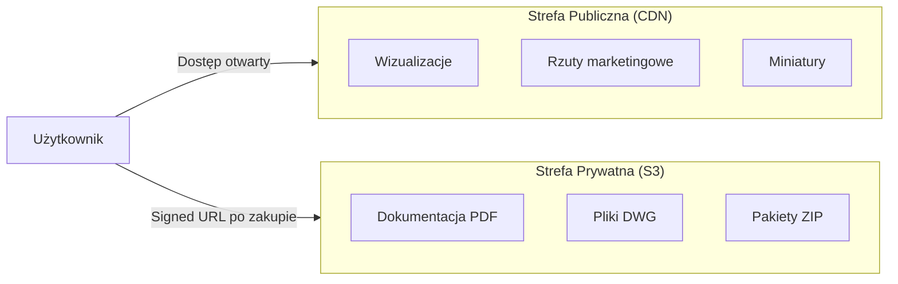

# 🔐 Bezpieczeństwo

> **Powiązane:** [Architektura](architecture.md) | [Model Danych](data_model.md)

---

## Ochrona Danych Osobowych (PII & GDPR)

| Mechanizm | Opis |
|-----------|------|
| **Application Level Encryption** | Szyfrowanie kolumn wrażliwych (email, telefon) przed zapisem do DB (AES-256) |
| **Klucze** | Master Key w zewnętrznym sejfie (KMS/Vault), niedostępny w repozytorium |
| **Logi** | Automatyczna sanityzacja (maskowanie) danych osobowych |
| **Środowiska Dev** | Praca wyłącznie na danych zanonimizowanych (Seeding/Faker) |

---

## Płatności (PCI DSS 4.0)

| Mechanizm | Opis |
|-----------|------|
| **Model** | SAQ A (pełne przekierowanie do operatora płatności) |
| **Ochrona Frontend** | Content Security Policy (CSP) + monitorowanie integralności skryptów |

---

## Uwierzytelnianie

| Mechanizm | Opis |
|-----------|------|
| **Hasła** | Hashowanie algorytmem Argon2id |
| **Admin** | Wymuszone 2FA (TOTP/YubiKey) dla panelu zarządzania |

---

## Retencja Danych

- Automatyczne usuwanie porzuconych koszyków po 30 dniach
- Anonimizacja kont nieaktywnych (z wyjątkiem danych fakturowych)

---

## Strategia Bezpieczeństwa Plików

| Strefa | Zawartość | Dostęp |
|--------|-----------|--------|
| **Public** | Rzuty funkcjonalne (bez wymiarowania), wizualizacje | CDN, cache'owany |
| **Private** | Pełna dokumentacja techniczna | Tylko Signed URL (15 min ważności) |

---

> 📅 **Ostatnia aktualizacja:** 2025-12-14
